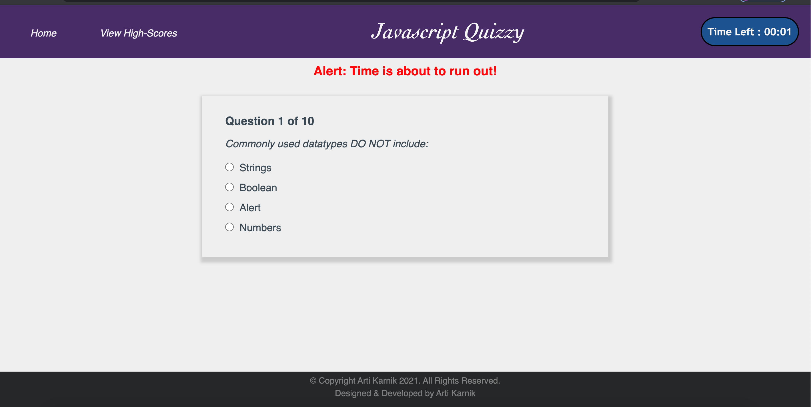
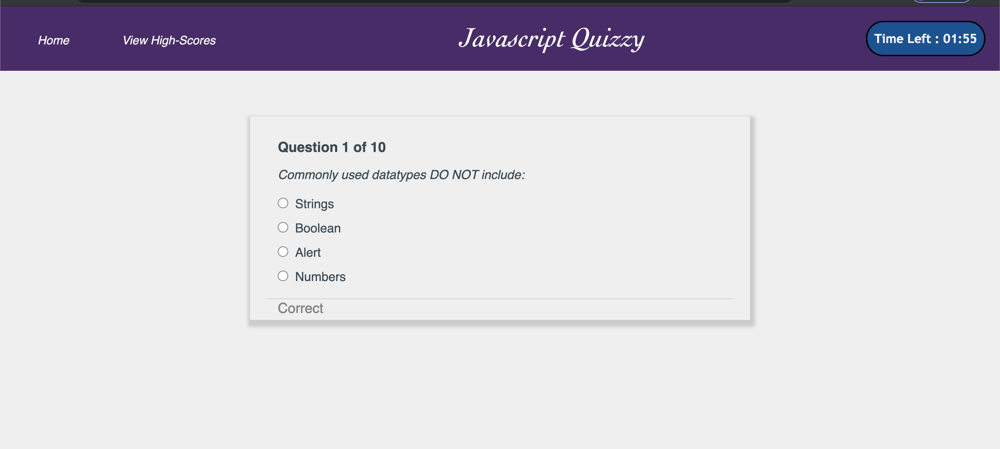

# Javascript-Quizzy

<strong> Project Summary: </strong>  
Quiz on JavaScript fundamentals that stores high scores. It have multi-choice questions to be answered in given time-limit.

      
       
       s
   
      
   
      

 

<strong> Purpose: </strong>  
Apply learnings from Javascript with HTML, CSS & Bootstrap to build a multi-page Quiz application   

<strong> Description: </strong>  
 This application is a 10 question multiple choice quiz on the topic of web development. User has 2 minutes in which to try & answer all questions. At the end of the quiz, user have option to submit the score. Used HTML, CSS & Javascript and Bootstrap for responsiveness.  
 
<strong>Instruction: <strong>  
• For every correct answer, 10 points are awarded. For every incorrect answer, a buzzer sounds & 5 seconds are deducted from the remaining time. In both cases, either 'Correct' or 'Wrong', is displayed once an option choice is selected. Users cannot change the answer choice once selected in the instance.

• Countdown timer of the remaining time is shown to the user in the top right corner of the page.

• As quiz time elapses, when the last 10 seconds remain, an alert message is shown to the user.

• 'View HighScores' page is maintained that will display the entered name & corresponding score of the quiz. Users have the option to clear or reset these high scores & all previous quiz information will be erased if done.

<strong> Other Features: </strong>  
Responsive:   
When the browser window size is reduced to a point where the page becomes responsive or this page were to be accessed on a mobile browser, the menu tabs are converted to a drop down menu which is shown with a 3-horizontal line icon in top right corner of the page. Clicking on it opens or closes the 
menu options & available pages can be accessed from here.   

<strong>Testing: </strong>  
Unit tested the page on Windows (Chrome, IE11 & Edge), Mac, Mobile to ensure that the layout is consistent in full view as well as in the responsive mode.   

<strong> Code Installation: </strong>  
$ cd [path_to_save_codebase]  
$ git clone https://github.com/arti-karnik/Javascript-Quizzy  

<strong> Github Profile: </strong>  
https://github.com/arti-karnik

<strong> Application Live URL: </strong>  
https://arti-karnik.github.io/Javascript-Quizzy/
